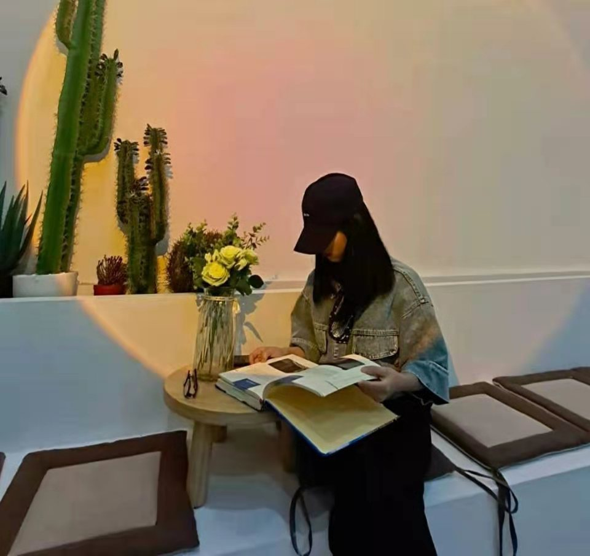
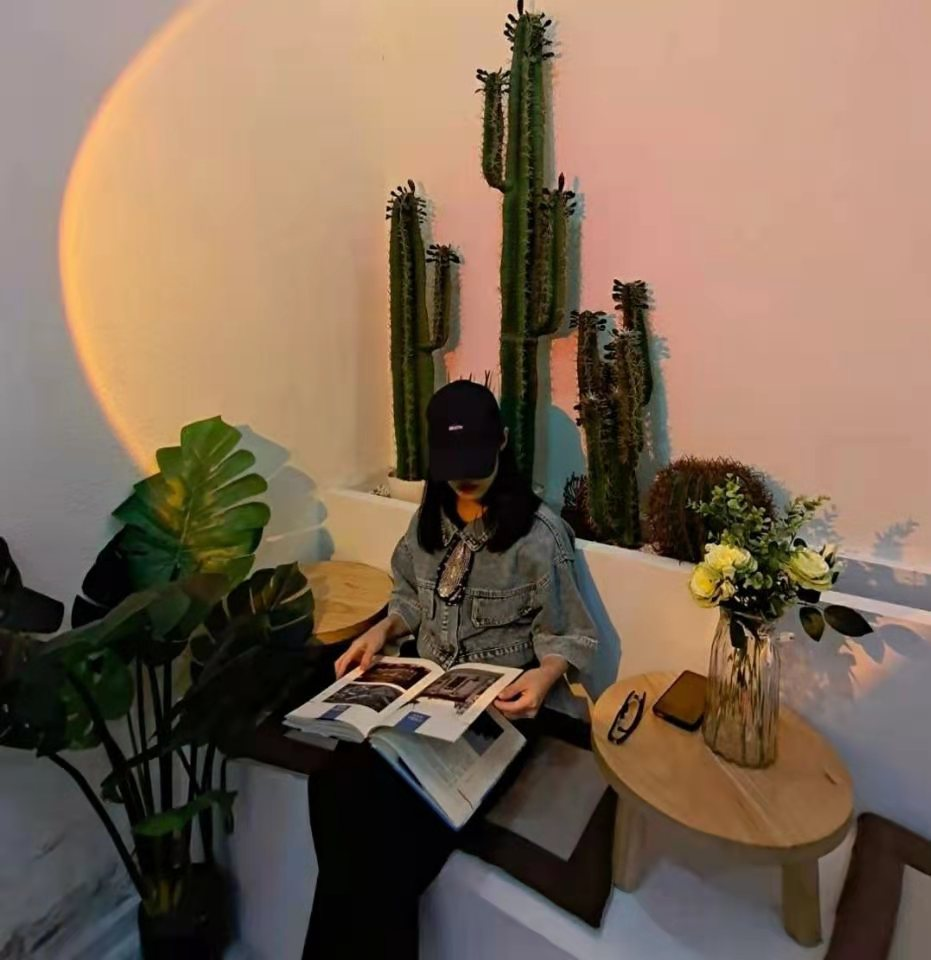

<!-- saved from url=(0174)file:///C:/Users/%E5%8D%8E%E7%A1%95/Documents/WeChat%20Files/wxid_53yqlv72nhri22/FileStorage/File/2021-08/%E6%96%B0%E5%BB%BA%E6%96%87%E6%9C%AC%E6%96%87%E6%A1%A3%20(2)(1).html -->
<html><head><meta http-equiv="Content-Type" content="text/html; charset=UTF-8"></head><body>

    

        

                

            

        

               

            

        

                

            

        

                

            

        

                

            

        

                 

            

        

            

        

        

            

        

        

            

        

        

            

        

        

            

        

        

            

        

    

</body></html>
